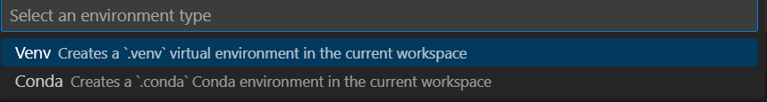
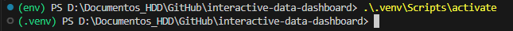

# Getting started
Here you can find the steps to set up the python environment in VScode

Source: https://code.visualstudio.com/docs/python/python-tutorial

1. Ctrl+Shift+P > Python: Create Environment

2. Select "Venv"

3. In the next drop-down menu, select the Python interpreter installed in yoour computer
4. Ctrl+Shift+P > Python: Select Interpreter
5. Select ".venv", that you just created
6. In the terminal of VScode, activate the new interpreter with

7. Install the libraries listed in "requirements.txt". You can use `pip install -r requirements.txt`
8. To execute the code, you might need to do *right click > Run Python > Run Python File in Terminal*